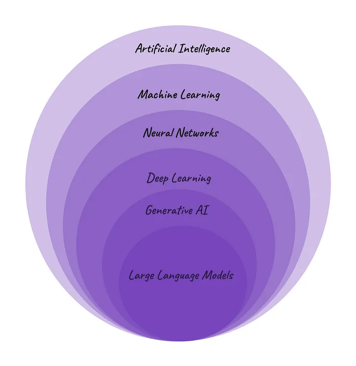

# **Day 1[Part 1]: LLM Basics and Foundations**

   History and Background

   Large Language Models (LLMs)

   How do LLMs Work?

   Training LLMs

   What are LLMs Used for?

   LLM Challenges.

# **History and Background:**

The provided virtual representation illustrates how these terms fit into
a hierarchy.

In summary,

**Artificial Intelligence (AI)** is about making machines think and
behave like humans.

**Machine Learning (ML)** is a part of AI that teaches computers to
learn from data and make predictions without being explicitly
programmed.

**Neural Networks (NNs)**, a subset of ML, mimic the human brain\'s
structure and are crucial in deep learning algorithms.

**Deep Learning (DL)** is great for solving complex problems, such as
recognizing images or translating languages.

**Generative AI (GenAI),** a subset of DL, can create all sorts of
content based on what it has learned.

**Large Language Models (LLM)**, a subset of generative AI, specialize
in generating human-like text by learning from extensive textual data.

Gen AI and LLMs has transformed the AI machines to produce content like
images, audios, videos, music and text. Gen AI models generates new
content from the human created datasets, unlike other models that
classify. Foundation models of Gen AI are capable of multi-tasking like
summarization, Q&A and classification with minimal training and data,
adapting to various use cases effectively. Example of such a model is
ChatGPT.

Generative AI learns through supervised learning, where it\'s fed
human-made content with labels. By studying this data, the model gets
good at creating similar content to training data. Generative AI is not a new idea. A classic example of early Gen AI is
the Markov chain, invented by Russian mathematician Andrey Markov in
1906. These models were first used for things like predicting the next
word in a sentence. But they were too simple to make text that sounded
real.

The field of AI has changed over years with powerful architectures and
large datasets.

- In 2014, generative adversarial networks (GANs) came about. They work
with two models---one creating output and the other deciding if it\'s
real or fake. This made generated content much more realistic, like with
models such as StyleGAN.

- Then, in 2015, diffusion models showed up. They keep improving their
output to make new data that looks like what they were trained on. This
made it possible to create more realistic images, like with Stable
Diffusion.

- In 2017, Google introduced transformers. These encode each word in a
text and make a map of how they relate to each other. This helps the
model make sense in generating text, like with ChatGPT. The boom in
generative AI isn\'t just because we have more data. It\'s also thanks
to different new methods like GANs, diffusion models, and transformers,
all adding excitement of the field.

# **Large Language Models (LLMs)**

A large language model is an advanced type of language model that is
trained using deep learning techniques on massive amounts of text data.
These models are capable of generating human-like text and performing
various natural language processing tasks.

The term \"Large\" refers to that, LLMs are trained on vast amounts of
data. This size is crucial because it lets them understand complex
language patterns better. The term "Language models" are essentially
algorithms or systems that are trained to understand and generate
human-like text. They serve as a representation of how language works,
learning from diverse datasets to predict what words or sequences of
words are likely to come next in a given context.

LLMs can perform many types of language tasks, such as translating
languages, analyzing sentiments, chatbot conversations, and more. They
can understand complex textual data, identify entities and relationships
between them, and generate new text that is coherent and grammatically
accurate. Popular LLMs are GPT-3, Gemini, Claude, etc

Older language models were smaller and couldn\'t grasp language
complexities as well. But with advancements in technology and powerful
computers, we can built much larger models like ChatGPT. These LLMs,
with billions of parameters, excel at understanding and generating
language.

# **How do LLMs Work?**

LLMs work through a combination of machine learning and deep learning
techniques. Machine learning involves training a program with large
datasets to recognize patterns without human help. LLMs use deep
learning, a type of machine learning where programs learn to recognize
patterns on their own, although some human adjustment is usually needed.

Deep learning uses probability to learn. A deep learning model cannot
actually conclude anything from a single sentence. But after analyzing
trillions of sentences, it could learn enough to predict how to
logically finish an incomplete sentence, or even generate its own
sentences.LLMs are built on neural networks, like the human brain. These networks
are made of interconnected nodes that communicate with each other. They
have layers, including an input and output layer, and they pass
information when their outputs reach a certain level.

The specific kind of neural networks used for LLMs are called
transformer models. Transformer models are able to learn context ---
especially important for human language, which is highly
context-dependent. Transformer models use a mathematical technique
called self-attention to detect subtle ways that elements in a sequence
relate to each other. This makes them better at understanding context
than other types of machine learning. It enables them to understand, for
instance, how the end of a sentence connects to the beginning, and how
the sentences in a paragraph relate to each other.

This enables LLMs to interpret human language, even when that language
is vague or poorly defined, arranged in combinations they have not
encountered before, or contextualized in new ways. On some level they
\"understand\" semantics in that they can associate words and concepts
by their meaning, having seen them grouped together in that way millions
or billions of times.

Techniques like prompt engineering, fine-tuning, and reinforcement
learning with human feedback can improve their performance and help
remove biases and errors. It\'s crucial to ensure LLMs are reliable and
don\'t produce harmful content, which can be achieved through careful
training and monitoring.

## **Training LLMs**

Training LLMs is a complex process, it involves instructing the model to
comprehend and produce human-like text. Simplified steps of working of LLMs

## **1.Providing Input Text:**

-   LLMs start by reading lots of text from books, articles, and
    websites.

-   During training, they learn to predict the next word in a sentence
    based on what they\'ve read.

-   It learns patterns and relationships within the text data.

## **2.Optimizing Model Weights:**

-   LLMs have different \"weights\" for their parameters, which
    determine the importance of various features.

-   Throughout training, these weights are adjusted to minimize
    mistakes, making the model better at guessing the next word.

## **3.Fine-tuning Parameter Values:**

-   LLMs continuously adjust parameter values based on error feedback
    received during predictions.

-   This iterative process helps them get better at understanding
    language and making accurate guesses about what comes next.

This training process vary based on type of LLM being developed. Performance of LLM depend on two things.

1.  **Model Design:** This is all about how the LLM is put together. The
    fancier and more detailed it is, the better it can understand subtle
    parts of language.

2.  **Data Quality:** The stuff the LLM learns from matters a lot. If it
    reads a wide range of good-quality text, it\'ll understand language
    better than if it only sees a small amount of less useful text.

Training an LLM takes a lot of computer power. It can take days or even
weeks, depending on how complex the model is and how much data it\'s
trained on. Usually, powerful computers and specialized hardware like
high-performance GPUs are used to speed up the process. Once trained, LLMs can be customized for different tasks using smaller
sets of supervised data, a process called fine-tuning.

There are three common learning methods:

-   **Zero-shot learning:** The base LLM can handle various tasks
    without extra training, often by giving it prompts. But the accuracy
    may vary.

-   **Few-shot learning:** Giving the base model a few relevant examples
    improves its performance in a particular area.

-   **Domain Adaptation:** This is like few-shot learning, but with more
    data related to a specific application or field.

# **What are LLMs Used for?**

Large Language Models (LLMs) have changed how we process and create
language in the digital age. Companies like OpenAI have trained these models on vast amounts of data,
enabling them to understand and interpret human language accurately. Through Artificial Intelligence and Machine Learning, LLMs can analyze
and generate language resembling human writing. This advancement has led
to transformative applications across various fields, including content
creation, data analysis, and programming.

LLMs are reshaping how we live, work, and communicate by enhancing
search capabilities and producing high-quality content. Large Language Models (LLMs) have a wide range of applications in
various fields. Some of the real-world use cases of LLM are

**1.Content Generation:** LLMs are adept at understanding context and
creating coherent text. This makes them valuable for generating content
for marketing, social media, and other communication purposes. They
ensure high-quality and relevant content, benefiting platforms like
marketing tools, social media management systems, and advertising
agencies.

**2.Language Translation:** LLMs can translate languages accurately,
which is helpful for businesses that work with people from different
countries. They make sure the translations make sense and fit the
context.

**3.Text Summarization:** LLMs can read long documents and pull out the
important stuff to make shorter summaries. This helps researchers and
businesses save time by getting the main points without reading
everything.

**4.Question Answering and Chatbots:** LLMs can answer questions and
chat with people in a natural way. This is useful for things like
customer service and education, where people need answers or help.

**5.Content Moderation:** LLMs analyze text to identify inappropriate or
harmful content, maintaining a safe online environment by flagging or
filtering out violations. They are beneficial for social media
platforms, online forums, and community management tools, ensuring user
safety and respectfulness.

**6.Information Retrieval:** LLMs can understand what people are looking
for and find the right information in big databases or on the internet.
This helps improve search engines and other tools for finding
information.

**7.Educational Tools:** LLMs can help students learn by answering
questions, making summaries, and having conversations. This makes
learning more efficient and easier for students.

# **LLM Challenges:**

The challenges faced by LLM is categorized into different themes. They are

-   **Data Challenges:** These are about the data used for training and
    how the model deals with missing or incomplete data.

-   **Ethical Challenges:** This involves making sure the model doesn\'t
    have biases, respects privacy, and avoids generating harmful
    content.

-   **Technical Challenges:** These are about the practical aspects of
    using LLMs, like how to implement them effectively.

-   **Deployment Challenges:** This is about getting fully-functional
    LLMs into real-world situations smoothly.

## **Data Challenges:**

1.  **Data Bias:** Training data may have biases, leading to unfair
    results.

2.  **Limited World Knowledge and Hallucination:** LLMs may not
    understand real-world events well and can make up information.

3.  **Dependency on Data Quality:** The quality of training data greatly
    affects LLM performance.

## **Ethical and Social Challenges:**

1.  **Ethical Concerns:** Concerns regarding the responsible and ethical
    use of language models, especially in sensitive contexts.

2.  **Bias Amplification:** Biases in training data can get worse, which
    leads to unfair results or outputs.

3.  **Legal and Copyright Issues:** Potential legal complications
    arising from generated content that breaks copyrights or violates
    laws.

4.  **User Privacy Concerns:** Generating text from user inputs may pose
    privacy risks, especially with private or sensitive information.

## **Technical Challenges:**

1.  **Computational Resources:** LLMs need lots of computing power for
    training and deployment.

2.  **Interpretability:** Understanding complex model decision-making is
    tough.

3.  **Evaluation:** Assessing models across tasks is challenging,
    especially with freely generated content.

4.  **Fine-tuning Challenges:** Adapting pre-trained models for specific
    tasks is difficult.

5.  **Contextual Understanding:** LLMs may struggle to keep context in
    long passages or conversations.

6.  **Robustness to Adversarial Attacks:** LLMs can be vulnerable to
    intentional data manipulations.

7.  **Long-Term Context:** Maintaining coherence over long text or
    discussions is hard.

## **Deployment Challenges:**

1.  **Scalability:** Make sure that the model can handle more work as
    demand increases.

2.  **Latency:** Keeping response times fast, especially for real-time
    applications.

3.  **Monitoring and Maintenance:** Tracking model performance, finding
    issues, and doing regular maintenance to avoid problems.

4.  **Integration with Existing Systems:** Making sure the model works
    well with other software and systems.

5.  **Cost Management:** Keep the costs of deploying and maintaining the
    model low.

6.  **Security Concerns:** Protecting against potential attacks and
    vulnerabilities.

7.  **Interoperability:** Making sure the model works with other tools
    and systems.

8.  **User Feedback Incorporation:** Finding ways to use feedback to
    improve the model.

9.  **Regulatory Compliance:** Following rules and standards, especially
    regarding data protection.

10. **Dynamic Content Handling:** Dealing with changes in content and
    user interactions in dynamic environments.
