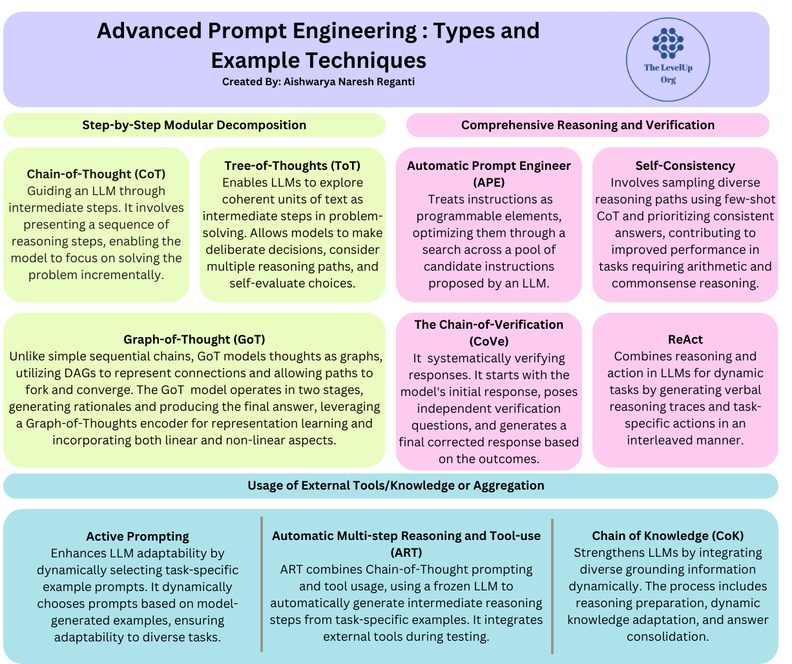
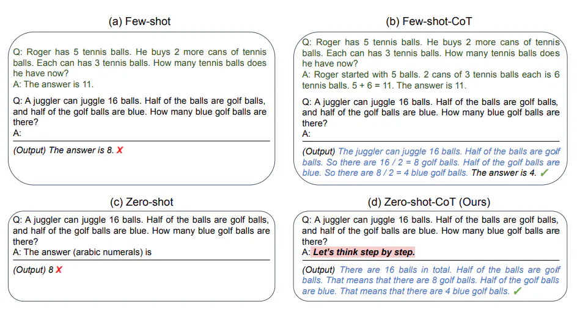
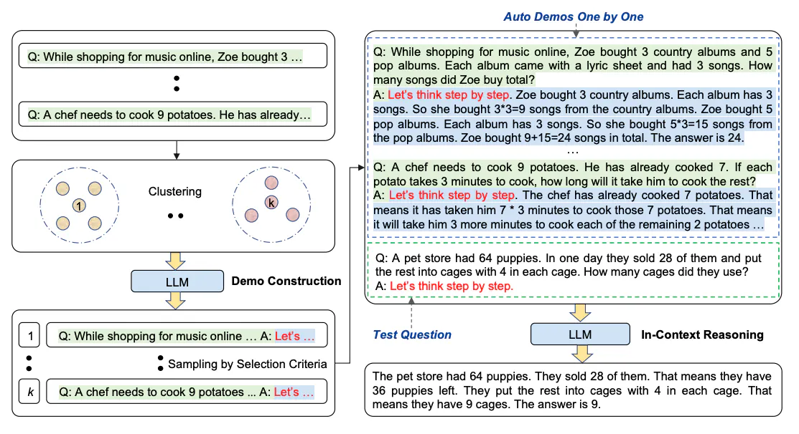
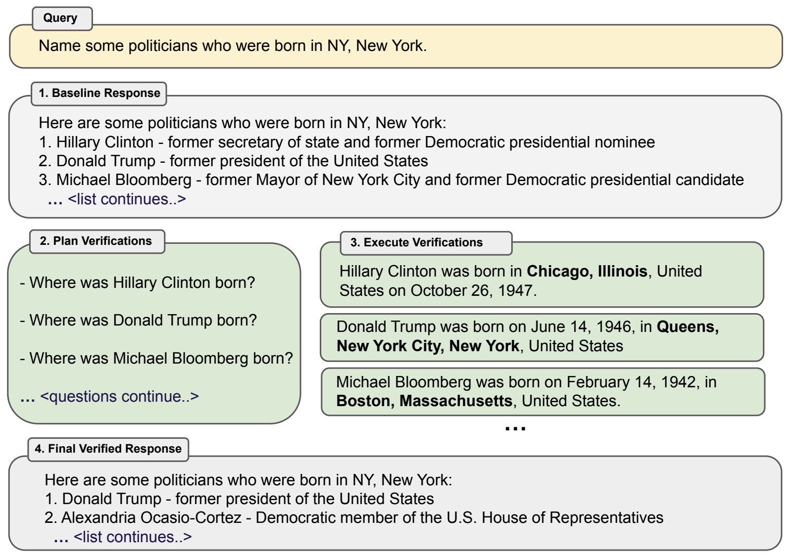
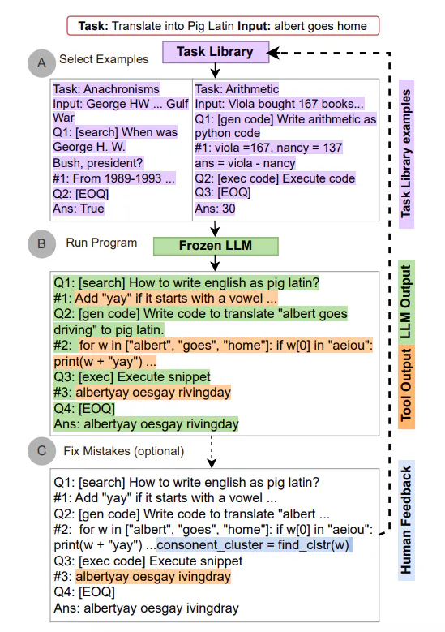
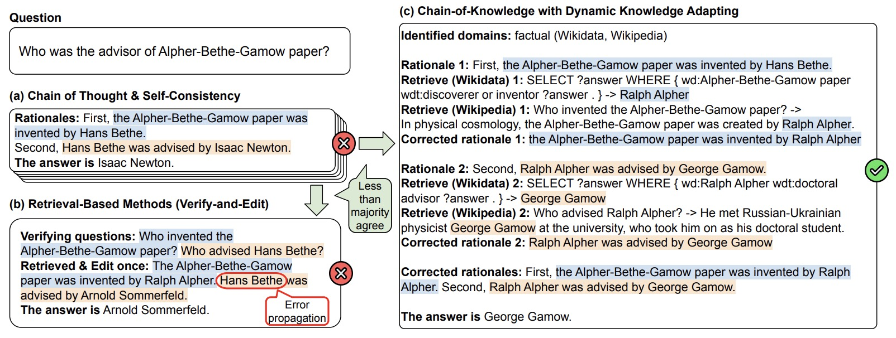

# **Day 2 Prompting and Prompt Engineering**

-   Prompting

-   Prompt Engineering

-   Why Prompting?

-   Basics of Prompting

-   Advanced Prompting Techniques

-   Risks in Prompting

-   Well-known tools for prompt engineering

## **Prompting**:

In the world of language models, \"prompting\" refers to the process of
giving precise instructions or queries to a model to produce specific
outputs. It\'s like providing input to a language model, usually in the
form of text, to get the desired responses. The goal of prompting is to
guide the model\'s understanding and generate outputs that match what
the user wants.

For example, if you want the language model to summarize a paragraph,
you might provide a prompt like \"Summarize the following passage:\".
Or, if you want it to generate a creative story, you might start with a
prompt like \"Write a story about a young adventurer who discovers a
hidden treasure.\"

Other Examples: Refer these
[examples](https://www.promptingguide.ai/introduction/examples)

## **Prompt Engineering**:

Prompt engineering is a rapidly evolving field that focuses on refining
prompts to maximize the capabilities of Language Models (LMs) in various
applications.

-   **Research and Application**: It\'s not just about creating prompts;
    prompt engineering enhances the performance of LLMs across different
    tasks, such as question answering and arithmetic reasoning.
    Researchers and users alike use prompt engineering to develop
    effective techniques that work seamlessly with LLMs.

-   **Beyond Design**: Prompt engineering goes beyond crafting prompts;
    it encompasses a range of skills necessary for interacting with and
    developing LLMs. It involves understanding the capabilities of LLMs,
    ensuring their safety, and introducing new features like integrating
    domain knowledge.

-   **Alignment with Human Intent**: Prompt engineering plays a crucial
    role in aligning AI behavior with human intent. It helps ensure that
    language models understand and respond to users\' needs accurately.

-   **Accessibility**: While some professionals specialize in prompt
    engineering, the skill is not limited to experts. Anyone refining
    prompts for models like ChatGPT is engaging in prompt engineering,
    making it accessible to users exploring the potential of language
    models.

## **Why Prompting?**

Large language models (LLMs) learn through unsupervised learning on huge
amounts of diverse text data. During training, they learn to predict the
next word in a sentence based on the words that come before it. This
helps them understand grammar, facts, and even some common sense.

Prompting is crucial for using these models well. Here\'s why:

1.  **Contextual Understanding**: LLMs are good at understanding
    context. When you give a prompt, it\'s important to structure it in
    a way that fits with what the model knows. This helps it give
    relevant answers.

2.  **Learning from Training Data**: During training, the model learns
    from lots of different text examples. Good prompts use similar
    language and structures to what the model has seen before. This
    helps it give answers that make sense based on what it\'s learned.

3.  **Transfer Learning**: LLMs use transfer learning. They take what
    they\'ve learned from training on lots of data and apply it to new
    tasks when prompted. A well-crafted prompt connects what the model
    knows to what you want it to do.

4.  **Contextual Responses**: By using prompts that match the model\'s
    training data, you get better answers. This is because the model
    understands and responds better within familiar contexts.

5.  **Reducing Bias**: LLMs might pick up biases from their training
    data. Good prompts can help reduce bias by giving more context or
    framing questions in a fair way. This is important for making sure
    the model\'s answers are ethical.

Prompting is how we guide LLMs to give helpful, relevant, and ethical
answers. It\'s a teamwork between users and models to get the right
outcomes. There\'s also a field called adversarial prompting where
people intentionally try to exploit weaknesses or biases in the model.
This is a challenge that researchers are actively working on solving to
make sure models give safe and accurate responses.

## **Prompting Basics**

Prompting means adding specific elements that match what you want the
model to do.

These Elements are

1.  **Instruction**: Clearly tell the model what you want it to do. This
    sets the context for its response.

2.  **Context**: Give extra info to help the model understand the task
    better.

3.  **Input Data**: Provide the text or question you want the model to
    work on.

4.  **Output Indicator**: Define how you want the model to present the
    answer.

Here\'s an example prompt for a text classification task:

**Prompt:**

>Classify the text into neutral, negative or positive.

>Text: I think the food was okay.

>Sentiment:

**Output:**

>Neutral

In this example:

-   **Instruction:** \"Classify the text into neutral, negative, or
    positive.\"

-   **Input Data:** \"I think the food was okay.\"

-   **Output:** \"Neutral\"

## **Best Practices for Prompt Engineering**:

OpenAI suggests some best practices for crafting prompts:

-   **Use the Latest Model**: Use the newest and best models for the
    best results.

-   **Structure Instructions**: Clearly separate instructions and
    context for clarity.

-   **Be Specific**: Clearly describe what you want in detail.

-   **Specify Output Format**: Show examples of how you want the answer
    presented.

-   **Use Different Approaches**: Start simple, then try giving
    examples, and if needed, fine-tune the model.

-   **Avoid Vagueness**: Be clear and direct in your instructions.

-   **Give Positive Guidance**: Tell the model what to do instead of
    what not to do.

-   **For Code Generation**: Use \"leading words\" to guide the model
    when generating code.

# **Advanced Prompting Techniques**:

Advanced prompting techniques are a hot topic in research, with
scientists always finding new ways to give instructions to models for
the best results. There are simple techniques like zero-shot, where only
instructions are given, and few-shot, where a few examples are provided
for the model to follow. More complex techniques are explained in
various research papers.

**Note:** While this list doesn\'t cover everything, existing prompting
methods can be roughly grouped into different categories. It\'s
important to understand that these categories aren\'t set in stone; they
may change as new techniques emerge. Also, many methods can fit into
multiple categories, combining the advantages of different approaches.

## **A.Step-by-Step Modular Decomposition**:

These methods involve breaking down complex problems into smaller,
manageable steps, making it easier to solve them. Instead of trying to
solve the entire problem at once, these methods guide the LLM through a
sequence of intermediate steps, allowing it to focus on one step at a
time. This approach enhances the LLM\'s ability to reason and is
especially useful for tasks that require multi-step thinking.

**Examples of Methods**:

### 1.  **Chain-of-Thought (CoT) Prompting**:

Chain-of-Thought (CoT) Prompting is a technique that enhances complex
reasoning capabilities by breaking down problems into intermediate
steps. It involves providing a sequence of reasoning steps to guide the
LLM through a problem, helping it to solve each step individually.

**1a. Zero-shot/Few-Shot CoT Prompting**:

Zero-shot CoT Prompting adds the instruction \"Let\'s think step by
step\" to guide the LLM through a systematic reasoning process. Few-shot
CoT Prompting provides the model with a few examples of similar problems
to improve its reasoning abilities.

**1b. Automatic Chain-of-Thought (Auto-CoT)**:

Automatic Chain-of-Thought (Auto-CoT) automates the generation of
reasoning chains for demonstrations. It uses LLMs with a \"Let\'s think
step by step\" prompt to automatically generate reasoning chains one by
one.

#### **Process**:

1.  **Question Clustering**: It groups questions based on similarity.

2.  **Demonstration Sampling**: It selects a representative question
    from each cluster and generates its reasoning chain using
    Zero-Shot-CoT with simple heuristics.

The goal is to reduce manual efforts in creating diverse and effective
examples. Auto-CoT ensures diversity in demonstrations, and the
heuristic-based approach encourages the model to generate simple yet
accurate reasoning chains.

### **2. Tree-of-Thoughts (ToT) Prompting**:

Tree-of-Thoughts (ToT) Prompting is a technique that builds on the
Chain-of-Thought approach. It encourages language models to explore
coherent units of text (\"thoughts\") as steps toward solving problems.
ToT allows models to make decisions deliberately, consider multiple
paths of reasoning, and self-evaluate their choices. It provides a
structured framework where models can backtrack or look ahead during
reasoning, making problem-solving more flexible and strategic. This
approach is especially useful for tasks requiring comprehensive and
adaptive reasoning.

#### **Key Characteristics**:

-   **Coherent Units (\"Thoughts\")**: ToT prompts LLMs to think in
    coherent units of text as intermediate reasoning steps.

-   **Deliberate Decision-Making**: It enables models to make decisions
    intentionally and explore different paths of reasoning.

-   **Backtracking and Looking Ahead**: Models can backtrack or look
    ahead during reasoning, giving them flexibility in problem-solving.

### 3.  **Graph of Thought Prompting**:

This approach recognizes that human thought processes often follow
non-linear patterns, deviating from simple sequential chains. In
response, the authors propose Graph-of-Thought (GoT) reasoning, a novel
approach that models thoughts not just as chains but as graphs,
capturing the intricacies of non-sequential thinking.

#### **Key Features**:

-   **Representation as Graphs**: Nodes represent thought units, and
    edges depict connections, allowing for a more realistic portrayal of
    human cognition.

-   **Directed Acyclic Graphs (DAGs)**: Unlike traditional trees, GoT
    uses DAGs, enabling modeling of paths that fork and converge,
    providing an advantage over linear approaches.

-   **Two-Stage Framework**: GoT operates in two stages: generating
    rationales and producing the final answer, leveraging a
    Graph-of-Thoughts encoder for representation learning.

-   **Integration Mechanism**: GoT representations are integrated with
    the original input through a gated fusion mechanism, combining
    linear and non-linear aspects of thought processes.

## B. Comprehensive Reasoning and Verification

Comprehensive Reasoning and Verification methods in prompting are a more
advanced approach where the AI doesn\'t just give a final answer but
also breaks down the problem into detailed steps. The unique thing about
these methods is that they include a self-checking system. As the AI
generates intermediate answers or steps, it checks them internally to
make sure they\'re right. If the check shows a mistake, the AI corrects
itself, making sure its reasoning makes sense. These checks make the
AI\'s reasoning stronger and more reliable because it can adjust and
improve its answers based on its own validation.

This advanced approach allows the AI to not only solve problems but also
ensure that its reasoning is logical and consistent throughout the
process.

### Example Methods:

### **1.Automatic Prompt Engineer (APE)**:

Automatic Prompt Engineer (APE) is a technique that treats instructions
as programmable elements and aims to make them better by searching
through a bunch of different instruction options suggested by an AI.
It\'s inspired by classic program synthesis and how humans craft
prompts. APE uses a scoring system to figure out which instruction is
the best. Then, it uses this top-scoring instruction as the prompt for
the AI. This automated method helps make prompt generation faster and
more efficient. It follows classic program synthesis principles and uses
the knowledge already in large language models to improve how well the
AI performs and gives the right outputs.

### **2.Chain of Verification (CoVe)**:

The Chain-of-Verification (CoVe) method tackles the problem of
inaccuracies in large language models by introducing a systematic
verification process. Here\'s how it works:

1.  The model starts by giving an initial response to a user\'s
    question, which might contain mistakes.

2.  CoVe then plans and asks independent verification questions to
    fact-check the initial response without any bias.

3.  The model answers these verification questions.

4.  Based on the verification outcomes, the model generates a final
    response, incorporating any corrections or improvements identified
    through the verification process.

CoVe ensures unbiased verification, leading to more accurate final
responses. It helps improve the overall performance of the model by
reducing the generation of inaccurate information.

### **3.Self-Consistency**:

Self-Consistency is a method that improves how prompts are created,
especially to overcome the drawbacks of simple greedy decoding in
chain-of-thought prompting. The idea is to generate many different
reasoning paths using few-shot CoT and then use these varied responses
to find the most consistent answer. This approach aims to make CoT
prompting better, especially for tasks that need arithmetic and
common-sense reasoning. By adding diversity to the reasoning paths and
focusing on consistency, Self-Consistency helps the language model give
more reliable and accurate responses within the CoT framework.

### **4.ReACT**:

The ReACT framework combines reasoning and action in large language
models (LLMs) to make them better at dynamic tasks. It works by
generating both verbal reasoning steps and task-specific actions
together. ReACT aims to solve issues seen in other models, like
chain-of-thought, which don\'t have access to the outside world and
might make mistakes or spread wrong information. Inspired by how humans
learn and make decisions by both thinking and doing, ReACT tells LLMs to
make, keep, and change plans for doing things dynamically. The model can
also use outside sources, like knowledge bases, to get more information,
making its responses more accurate and reliable.

#### **How ReAct Works**:

1.  **Dynamic Reasoning and Acting**: ReAct creates both verbal
    reasoning steps and actions, allowing it to handle complex tasks
    more effectively.

2.  **Interaction with External Environments**: The action part lets the
    model interact with outside sources to gather more information and
    improve its reasoning.

3.  **Improved Task Performance**: By integrating reasoning and action,
    ReAct performs better than other methods on language and
    decision-making tasks.

4.  **Enhanced Human Interpretability**: ReAct makes LLM responses
    easier to understand and more trustworthy for humans

## **C. Usage of External Tools/Knowledge or Aggregation**:

This category of methods uses external sources, tools, or combined
information to make LLMs perform better. They understand the importance
of getting information from outside sources for more accurate and
detailed responses. Aggregation techniques use multiple responses to
make the answers stronger. They know that different perspectives and
reasoning paths can help give better and more reliable answers.

### **1.Active Prompting (Aggregation)**:

Active Prompting is designed to make LLMs better at different tasks by
choosing task-specific example prompts dynamically. Unlike
Chain-of-Thought methods that rely on a fixed set of examples, Active
Prompting adjusts based on the task\'s challenges:

-   **Dynamic Querying**: It starts by asking the LLM questions, with or
    without a few example prompts.

-   **Uncertainty Metric**: It calculates uncertainty based on how much
    the generated answers disagree, showing where the model is unsure.

-   **Selective Annotation**: It selects questions where the model is
    most uncertain and asks humans to provide new examples tailored to
    those uncertainties.

-   **Adaptive Learning**: The model learns from these new examples,
    improving its understanding and adaptability for those questions.

Active Prompting helps LLMs actively find and learn from examples
specific to different tasks, making them better at handling various
challenges.

### **2.Automatic Multi-step Reasoning and Tool-use (ART) (External Tools)**:

ART is all about making LLMs handle tasks better. It combines
Chain-of-Thought prompting with tool usage. Instead of manually showing
how to do things, ART picks examples from a library and lets the LLM
generate intermediate steps automatically. During tests, it uses
external tools to help solve problems it hasn\'t seen before. ART is
flexible because humans can update the examples and tools it uses,
making it adaptable to different tasks.

### **3.Chain-of-Knowledge (CoK)**:

CoK strengthens LLMs by using information from diverse sources to avoid
making mistakes. It works in three steps: getting ready for reasoning,
adapting knowledge as it goes, and putting together the final answer. It
starts with some initial ideas and then adds more information step by
step from different sources, making sure the final answer is solid.
Compared to other methods, CoK uses a mix of different sources to find
information and adapts as it goes, making its answers stronger and more
reliable.

## **Risks of Prompting**:

Using prompts also brings risks, and one major concern is prompt
hacking, where attackers exploit weaknesses in LLMs. These risks
include:

1.  **Prompt Injection**:

    -   Risk: Attackers can add harmful or false content to prompts,
        leading LLMs to give inappropriate or biased responses.

    -   Context: By manipulating the text in prompts, attackers can make
        the AI say anything, which can compromise the accuracy and
        trustworthiness of its answers.

2.  **Prompt Leaking**:

    -   Risk: Attackers might extract sensitive information from the
        AI\'s responses, creating privacy and security issues.

    -   Context: Changing the input to try to reveal the prompt itself
        is a form of prompt leaking, which can expose private
        information.

3.  **Jailbreaking**:

    -   Risk: Jailbreaking lets users bypass safety features, resulting
        in the AI generating controversial or harmful content.

    -   Context: Prompt hacking methods like pretending can take
        advantage of the AI\'s difficulty in rejecting harmful prompts,
        allowing users to ask any question they want.

4.  **Bias and Misinformation**:

    -   Risk: Prompts with biased or misleading information can cause
        the AI to give biased or inaccurate responses, spreading
        misinformation.

    -   Context: Crafted prompts can manipulate the AI into producing
        biased or incorrect answers, reinforcing societal biases.

5.  **Security Concerns**:

    -   Risk: Prompt hacking is a broader security threat, as attackers
        can compromise the AI\'s content and potentially use it for
        malicious purposes.

    -   Context: It\'s important to have defenses in place, like
        prompt-based defenses and regular monitoring, to protect against
        prompt hacking and its security risks.

To tackle these risks, it\'s essential to have strong defensive
strategies, regularly check the AI\'s behavior, and be alert for
potential vulnerabilities introduced by prompts. Ongoing research and
development are also crucial to make LLMs more resilient against
prompt-based attacks and to reduce biases in their responses.

## **Well-known tools for Prompt Engineering**

These prompt engineering tools represent various applications, from
marketplaces and models to development frameworks and optimization
platforms.

1.  **Promptbase**: Promptbase is a platform that specializes in
    generating and refining prompts for AI models. It helps users craft
    effective prompts for various tasks, such as text generation or
    classification, by providing insights and analytics on prompt
    performance.

2.  **ChatGPT**: ChatGPT is a conversational AI model developed by
    OpenAI, which is designed to engage in natural language
    conversations with users. It\'s trained on a diverse range of
    internet text and can generate responses in a variety of
    conversational styles.

3.  **OpenPrompt**: OpenPrompt is an open-source library for
    prompt-based AI systems. It provides tools and resources for
    building and fine-tuning prompt-based models, allowing developers to
    experiment with different prompt formats and strategies.

4.  **AIPRM (AI Prompting & Refining Model)**: AIPRM is a framework for
    developing AI models that leverage prompts to guide their behavior.
    It focuses on refining prompts through iterative experimentation,
    aiming to improve model performance and adaptability across various
    tasks.

5.  **Hugging Face Transformers**: Hugging Face Transformers is a
    popular library for natural language processing (NLP) tasks,
    offering pre-trained models and tools for fine-tuning them on
    specific tasks. It includes implementations of state-of-the-art
    models like BERT, GPT, and RoBERTa, along with utilities for working
    with text data.

6.  **GPT-3 Playground**: The GPT-3 Playground is an interactive web
    application that allows users to explore and interact with OpenAI\'s
    GPT-3 model in real-time. Users can input prompts and see the
    model\'s responses, experimenting with different inputs to
    understand its capabilities.

7.  **LMScorer**: LMScorer is a tool for evaluating language models
    based on their likelihood scores. It calculates the probability of a
    given sequence of words according to a language model, which can be
    useful for tasks like text generation and machine translation.
