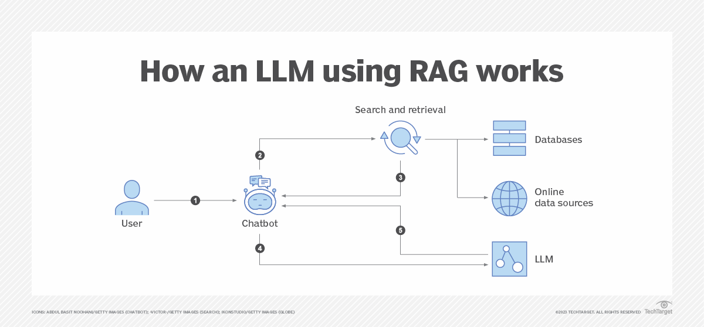
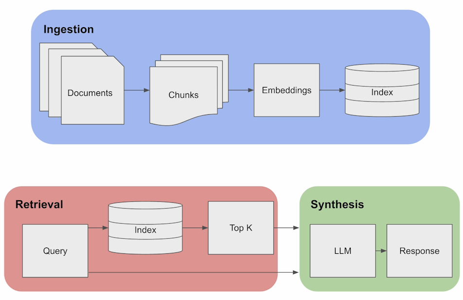
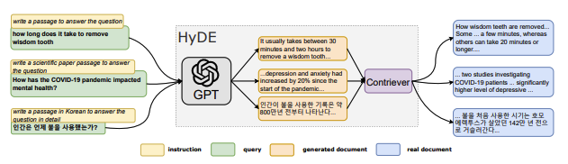
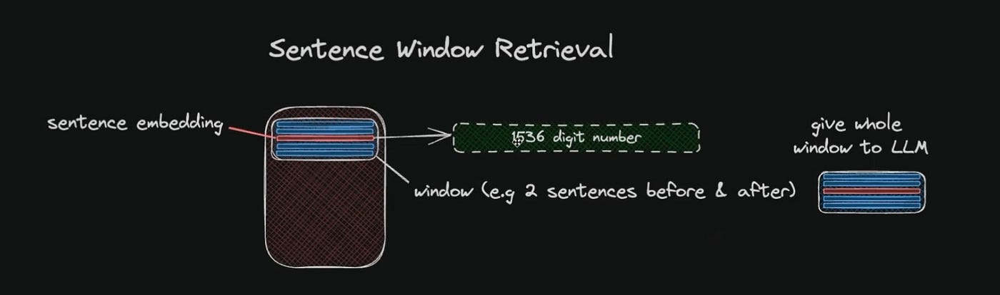
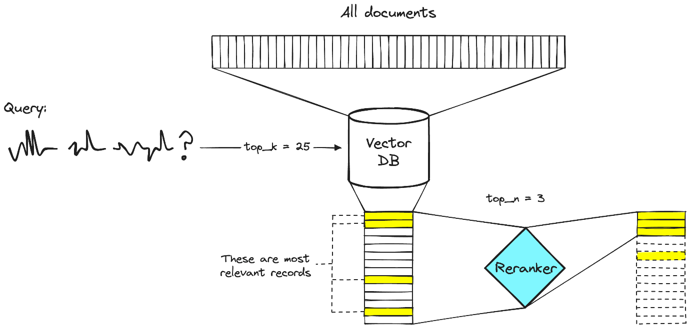

# **Day-3 Retrieval Augmented Generation (RAG)**

-   What is RAG?

-   History

-   Components of RAG

-   RAG Challenges

-   Improving RAG Components

# **What is RAG?**

General-purpose language models can be fine-tuned for common tasks like
sentiment analysis and named entity recognition without needing extra
knowledge. But for more complicated tasks that need a lot of
information, we can use a method called Retrieval Augmented Generation
(RAG).

RAG is a method introduced by Meta AI researchers to handle tasks that
need a lot of knowledge. It combines a text generator model with an
information retrieval system. This helps in giving more accurate and
reliable responses, avoiding mistakes known as \"hallucinations.\"

## **How Does RAG Work?**:

1.  **Retrieving Knowledge**: RAG takes an input and finds relevant
    documents from a source like Wikipedia. These documents become part
    of the context for the text generator.

2.  **Generating Output**: The text generator uses this combined input
    and context to create the final response.

3.  **Adaptability**: RAG can easily adapt to changes in information
    over time because it can access the latest facts without needing to
    retrain the whole model.

# **History**

RAG, short for Retrieval-Augmented Generation, is a new idea in large
language models (LLMs) that\'s changing how these models find
information.

**Early Days (1970s)**:

-   RAG\'s beginnings trace back to the 1970s when researchers started
    working on systems to find and understand text.

-   These early systems focused on specific topics like baseball and
    laid the groundwork for RAG\'s techniques.

**Rise of Q&A Services (1990s)**:

-   In the 1990s, services like Ask Jeeves became popular, where people
    could ask questions and get direct answers.

-   This sparked interest in AI systems that could give helpful
    responses, driving improvements in finding and generating answers.

**Modern RAG (2020)**:

-   The term \"RAG\" and its current framework were introduced in a 2020
    research paper by Meta AI and university researchers.

-   RAG allows language models to use external knowledge sources beyond
    their original training data, making their answers better.

# **Key Components of Retrieval Augmented Generation (RAG):**

RAG involves three main components: ingestion, retrieval, and synthesis.

### **Ingestion**:

In RAG, ingestion is about getting the data ready for the model to use
in generating responses. Here\'s what happens:

1.  **Chunking**: First, we break down the input text into smaller
    pieces or chunks, like paragraphs or sections. For example, if
    we\'re talking about the Renaissance, we\'d split an article into
    chunks based on different historical periods or topics.

2.  **Embedding**: Next, we transform these chunks into a format that
    the model can easily understand and process. This might involve
    turning the text into numbers (vectors) that capture the important
    information in each chunk. For example, for a section on the High
    Renaissance, we\'d create a vector that represents key artistic and
    historical details.

3.  **Indexing**: Finally, we organize these chunks in a way that makes
    them easy to find when needed. We create a searchable database of
    these vectors so the model can quickly retrieve relevant
    information. For example, each chunk is stored as a vector in a
    database, making it easy to find and retrieve when a user asks a
    question.

### **Retrieval**:

In the retrieval phase, the model finds the most relevant chunks based
on a user\'s query. Here\'s how it works:

1.  **User Query**: The user asks a question, like \"Tell me about the
    Renaissance period.\"

2.  **Query Conversion**: The question is converted into numbers
    (vectors) using the same embedding model used in the ingestion
    phase.

3.  **Vector Comparison**: The model compares these vectors to the
    vectors in the database to find similar chunks.

4.  **Top-K Retrieval**: The model retrieves the top-K (a predefined
    number) most relevant chunks based on similarity to the query
    vectors.

5.  **Data Retrieval**: Finally, the model retrieves the actual content
    from these chunks to include in its response to the user.

### **Synthesis**:

In the synthesis phase, the model combines its own language generation
with the retrieved information to form a response. It presents the final
answer to the user, incorporating both its own knowledge and the context
from the retrieved chunks. This way, the user gets a well-informed
response that draws on historical documents stored in the knowledge
base.

# **RAG Challenges**

Retrieval Augmented Generation (RAG) has several challenges that need to
be addressed to ensure its effectiveness and reliability. Here are some
key challenges:

**1. Data Ingestion Complexity**:

*Challenge*: Dealing with lots of different types of data and making
sure the system can handle it all efficiently. This means figuring out
how to manage requests, handle errors, and make sure the system can grow
as needed.

*Example*: Think about trying to organize and process a huge amount of
information, like scientific articles, so a computer can understand and
use it effectively.

**2. Efficient Embedding**:

*Challenge*: Making sure that the system can turn big sets of data into
a format that\'s easy for the computer to work with. This involves
dealing with limits on how much data can be processed at once, dealing
with errors, and making sure the system can handle the workload.

*Example*: Imagine a computer trying to turn a bunch of news articles
into numbers it can understand quickly, while also making sure it
doesn\'t use up too much computing power.

**3. Vector Database Considerations**:

*Challenge*: Figuring out how to store all the data in a way that\'s
easy to search and use. This means understanding how much computing
power is needed, keeping an eye on how things are running, and making
sure everything stays working smoothly.

*Example*: Think about setting up a system to store lots of different
documents in a way that makes it easy for a computer to find what it
needs, even if the documents are all different lengths and topics.

**4. Fine-Tuning and Generalization**:

*Challenge*: Making sure that the system works well for lots of
different tasks, even after it\'s been trained for a specific job. This
involves finding the right balance between making the system really good
at one thing and still being able to do other tasks well.

*Example*: Imagine trying to teach a computer to answer questions about
lots of different topics without making it forget how to do other
things, like writing creatively.

**5. Hybrid Parametric and Non-Parametric Memory**:

*Challenge*: Figuring out how to combine the things the computer already
knows with new information it finds. This involves making sure the
system can use both its existing knowledge and new facts without getting
confused or making mistakes.

*Example*: Think about teaching a computer to use what it already knows
about a topic while also letting it look up new information online,
without mixing up the two.

**6. Knowledge Update Mechanisms**:

*Challenge*: Making sure that the system stays up-to-date with new
information as it comes out. This means figuring out how to keep the
system learning and changing as new things are discovered.

*Example*: Imagine trying to teach a computer about medicine and making
sure it knows about the latest treatments and research findings.

## **Improving RAG components (Ingestion)**

 1.  **Better Chunking Strategies**: 
    Chunking is like breaking text into
    smaller pieces to handle it better. In RAG, we want to do this more
    efficiently. Here are some ways we\'re improving chunking:

-   **Content-Based Chunking**: We break down text based on its meaning
    and sentence structure. This helps keep the text\'s sense and
    coherence. But it needs more computer power and is more complex.

-   **Sentence Chunking**: We split text into full, grammatically
    correct sentences. This keeps the text together well, but the sizes
    of these chunks can vary a lot.

-   **Recursive Chunking**: This splits text into chunks at different
    levels, making a sort of hierarchy. It gives more detail and variety
    in text, but it\'s harder to manage.

 2.  **Better Indexing Strategies**: 
    Indexing is like organizing data so
    we can find things quickly. Here are some ways we\'re improving
    indexing:

-   **Detailed Indexing**: We break down chunks into smaller parts and
    give each one a special name and description based on what it\'s
    about. This gives us a lot of detail and accuracy, but it needs more
    computer memory and time.

-   **Question-Based Indexing**: We organize chunks by topics or
    categories and give each one a name and description based on what
    people might ask about. This makes it easier to find things people
    are looking for, but we might lose some details and accuracy.

-   **Optimized Indexing with Chunk Summaries**: We create a summary for
    each chunk using special techniques. Then, we give each one a name
    and description based on the summary. This gives us a good mix of
    detail and variety, but it\'s harder to make and compare the
    summaries.

## **Improving RAG Components (Retrieval)**:

 1.  **Hypothetical Questions and HyDE**:

    -   **Hypothetical Questions**: This involves making up a question
        for each part of a text, turning them into special numbers, and
        searching for them. This makes the search better because these
        questions are more similar to real questions than just using the
        text itself.

    -   **HyDE (Hypothetical Response Extraction)**: Here, we make up a
        possible answer for a question, which helps with searching. By
        using the numbers that represent the question and its made-up
        answer, we can find better matches.

2.  **Context Enrichment**:

    -   **Sentence Window Retrieval**: We break down texts into
        sentences and focus on finding the most important one first.
        Then, we include a few sentences before and after it to give
        more context. This helps the language model understand the
        situation better and give better answers.

-   **Auto-Merging Retriever**: We split documents into smaller parts
    and look for them first. If we find a lot from the same big part, we
    merge them together. This helps the model understand both the
    details and the big picture, making its answers more complete.

3.  **Fusion Retrieval or Hybrid Search**:

    -   This method combines old-style word searches with newer, smarter
        searches. By using both methods together, the AI can find more
        relevant information and give better answers.

4.  **Reranking & Filtering**:

    -   After finding information, we go through it again to make sure
        it\'s good. We might filter out bad matches or rearrange them to
        find the best ones. This happens before the final answers are
        given.

5.  **Query Transformations and Routing**:

    -   **Query Transformations**: We make complicated questions simpler
        by breaking them down into smaller parts. If a question isn\'t
        clear, we rewrite it to make it better. Also, if a question
        needs information from a chat, we condense that chat into a new
        question.

    -   **Query Routing**: We figure out where the information is and
        send questions there. This helps us find the right answers
        faster, especially when the information is stored in different
        places.

## **Improving RAG components (Generation)**:

When it comes to generating responses with Large Language Models (LLMs)
in Retrieval Augmented Generation (RAG), there are different methods we
can use to make the answers better. The basic method involves putting
together all the relevant pieces of information and giving them to the
LLM at once. But there are more advanced ways to do it that can make the
answers even better. Here are a couple of methods:

**1. Response Synthesis Approaches**: This method involves three steps:

-   **Iterative Refinement**: We refine the answer by giving the
    retrieved information to the Language Model in smaller parts, one at
    a time.

-   **Summarization**: We summarize the retrieved information to make it
    shorter and easier for the Language Model to understand.

-   **Multiple Answers and Concatenation**: Sometimes, we generate more
    than one answer based on different parts of the information, and
    then put them together or summarize them into one answer.

**2. Encoder and LLM Fine-Tuning**: This approach focuses on fine-tuning
the LLM models in our RAG system:

-   **Encoder Fine-Tuning**: We fine-tune the Transformer Encoder to
    make the quality of embeddings (basically, how the model understands
    the information) better and improve how it retrieves context.

-   **Ranker Fine-Tuning**: If we\'re not sure about how good the base
    Encoder is at retrieving information, we can use a cross-encoder to
    re-rank the retrieved results.

-   **RA-DIT Technique**: This technique involves tuning both the LLM
    and the Retriever (the part that finds the relevant information)
    based on triplets of query, context, and answer. It helps improve
    both the understanding of the context and the generation of the
    answer.
