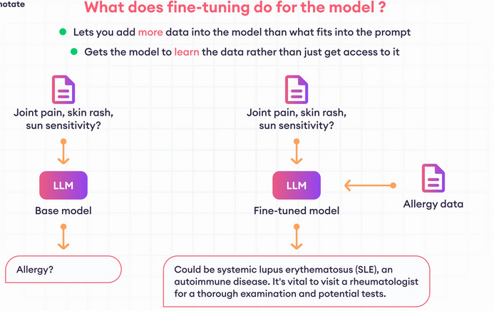
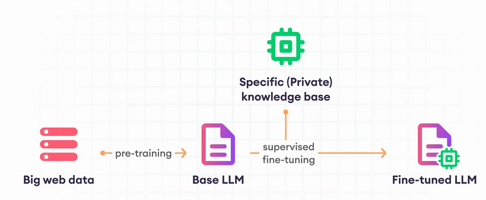
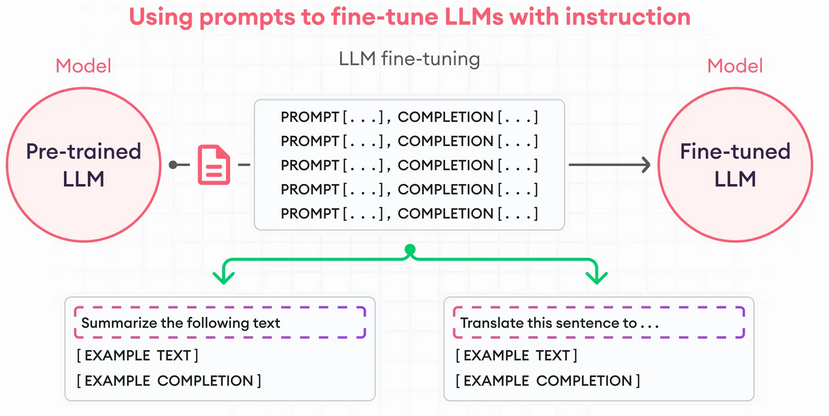
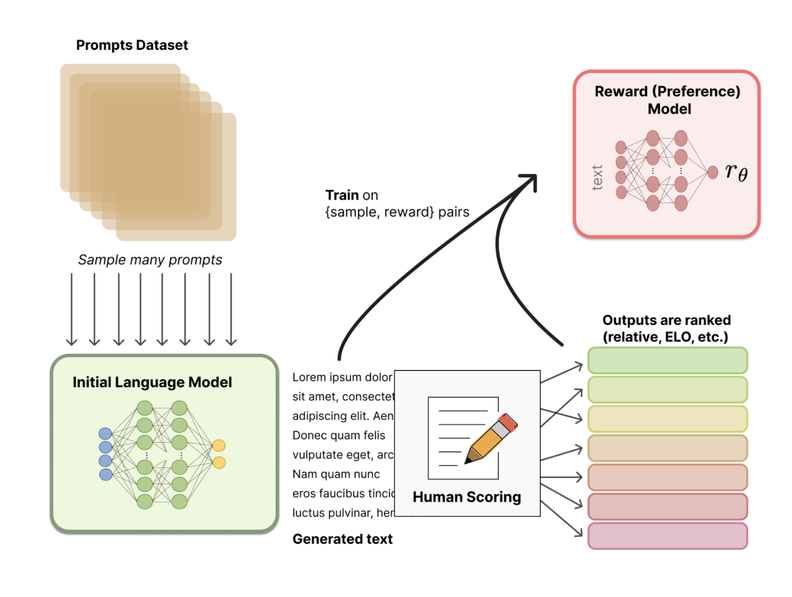
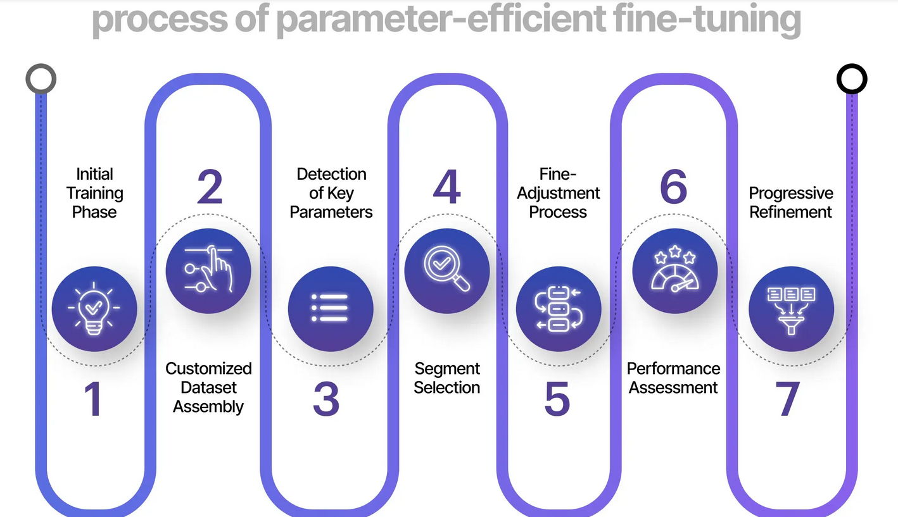

# **Fine Tuning LLMs**

-   What is LLM Fine-Tuning?

-   When to use Fine Tuning?

-   Types of Fine-Tuning Methods

# **What is LLM Fine-Tuning?**

Large language model (LLM) fine-tuning is the process of taking
pre-trained models and further training g them on smaller, specific
datasets to refine their capabilities and improve performance in a
particular task or domain. Fine-tuning is about turning general-purpose
models and turning them into specialized models. It bridges the gap
between generic pre-trained models and the unique requirements of
specific applications, ensuring that the language model aligns closely
with human expectations.

**Example:**

Imagine you have a really smart robot that understands a lot of general
stuff about language, but you want it to be even better at a particular
job, like helping doctors write medical reports.

So, you take this smart robot, which is like a pre-trained language
model such as GPT-3, and you teach it more about medical stuff by giving
it lots of medical reports and notes to read and learn from. As it reads
and learns from this specialized data, it gets better at understanding
medical terms, the way doctors talk, and how medical reports are
structured.

After this extra training, the robot becomes much more helpful to
doctors because it\'s now specialized in medical language and can write
accurate and coherent reports. This process of fine-tuning is like
customizing a tool to fit a specific job perfectly, making it more
useful in real-world situations.

# **When to use Fine-Tuning?**

Fine-tuning is like customizing a tool to fit a specific job perfectly.
You might use it when you have a pr e-trained model that\'s already good
at general tasks, but you want it to be even better at something
specific. Here\'s when and why you might use fine-tuning:

1.  **When You Have a Pre-Trained Model**: First, you need a pre-trained
    model, which is like a smart robot that\'s already learned a lot
    about language. These models are trained on huge amounts of text
    from the internet and can understand language really well.

2.  **When You Have a Specific Task**: Let\'s say you have a particular
    task in mind, like identifying types of animals from descriptions.
    The pre-trained model might be good at understanding general
    language, but it might not know much about animals.

3.  **When You Have Specialized Data**: You gather a dataset with lots
    of examples related to your specific task. In our case, it could be
    descriptions of different animals. This dataset helps the model
    learn more about the task it needs to do.

4.  **When You Want Better Performance**: By fine-tuning the pre-trained
    model with your specialized data, you\'re teaching it to understand
    the specific things it needs to do for your task. This makes it much
    better at that task than if you just used the pre-trained model as
    it is.

5.  **When You Want to Save Time and Resources**: Fine-tuning is often
    faster and requires less data than training a model from scratch.
    Since the pre-trained model already knows a lot, it just needs a
    little tweaking to become great at your specific task.

# **Types of Fine-Tuning**

Fine-tuning methods for language models can be split into two main
types: supervised and unsupervised.

## **Unsupervised Fine-Tuning Methods:**

1.  **Unsupervised Full Fine-Tuning**: This method updates the knowledge
    base of a language model without changing how it behaves. For
    example, if you want to teach the model about legal language or a
    new language entirely, you can use a dataset of relevant documents
    or texts without explicit labels. This helps the model refine its
    understanding without needing labeled examples.

2.  **Contrastive Learning**: Contrastive learning trains the model to
    tell apart similar and different examples. By pushing similar
    examples closer together and dissimilar ones apart in its \"mind,\"
    the model learns to capture subtle differences and patterns in the
    data. This is useful when understanding nuances and distinctions is
    important, like in tasks where fine details matter.

## **Supervised Fine-Tuning Methods**:

1.  **Parameter-Efficient Fine-Tuning (PEFT)**: This strategy focuses on
    updating only a small set of parameters in the model instead of all
    of them, which saves computational resources. Techniques like
    Low-Rank Adaptation (LoRA) operate on the idea that only certain
    parameters need updating for specific tasks. By training a low-rank
    matrix instead of adjusting every parameter, PEFT makes fine-tuning
    more efficient.

2.  **Supervised Full Fine-Tuning**: Here, all parameters in the model
    are updated during training. This method requires more memory and
    computational power because it updates everything in the model.
    It\'s useful when you need a thorough adjustment for the model to
    perform well on a specific task or domain.

3.  **Instruction Fine-Tuning**: This method involves training the model
    with examples that explicitly show it how to respond to specific
    queries or tasks. For instance, if you want the model to summarize
    or translate text, you provide examples with clear instructions like
    \"summarize this text\" or \"translate this phrase.\" Instruction
    fine-tuning helps the model understand and execute specific tasks
    precisely.

4.  **Reinforcement Learning from Human Feedback (RLHF)**: RLHF goes a
    step further by incorporating reinforcement learning principles,
    where human evaluators rate the model\'s outputs based on specific
    prompts. These ratings act as rewards, guiding the model to improve
    its parameters to receive more positive feedback. RLHF is
    resource-intensive but results in better model performance aligned
    with human preferences.

## **Instruction Fine-Tuning**:

Instruction fine-tuning is a method used to make a machine learning
model better at various tasks by training it with specific examples that
show how it should respond to certain queries or prompts. The dataset
used for fine-tuning large language models needs to match the purpose of
the instruction. For instance, if we want to improve a model\'s
summarization skills, we need a dataset with examples that start with an
instruction to summarize, followed by text to summarize. Similarly, for
translation tasks, the dataset should include instructions like
\"translate this text.\" These pairs of instructions and responses help
the model understand how to perform a specific task effectively.

## **Reinforcement Learning from Human Feedback (RLHF)**:

Reinforcement Learning from Human Feedback (RLHF) is a way to make
language models (LMs) smarter by learning from human input.

Here\'s how it works in simple steps:

1.  **Starting with a Smart Model**: First, we begin with a smart LM
    that already knows a lot about language. This LM has been trained
    using regular methods. We want this LM to respond well to different
    instructions.

2.  **Learning What Humans Like**: Next, we create a model called the
    reward model (RM). This model figures out what humans prefer by
    looking at text examples and how humans rank them. For instance, if
    people like some responses more than others, the reward model learns
    to give those responses higher scores.

3.  **Getting Better with Feedback**: Then, we use reinforcement
    learning (RL) to fine-tune the smart LM. We use the reward model\'s
    scores to guide the LM to produce text that people like more. This
    way, the LM gets better at generating text that matches human
    preferences. We adjust the LM\'s settings to make sure it keeps
    getting better without making it too complicated.

## **Parameter Efficient Fine-Tuning (PEFT)**:

Parameter-Efficient Fine-Tuning (PEFT) is a method to make adjusting
large language models easier and less resource-heavy. Instead of
changing everything in the model, PEFT only tweaks a small part of it
while keeping the rest the same. This helps save computer power and
memory.

PEFT is a way to fine-tune language models that\'s easier on computers
and saves memory. It keeps the model\'s performance high while making
changes, and you can use it for lots of different tasks without needing
fancy equipment.

### **Advantages of PEFT**:

1.  **Less Work for Computers**: PEFT doesn\'t need as much computing
    power as other methods, so you can use it on simpler computers.

2.  **Saves Memory**: It doesn\'t use up too much memory because it
    doesn\'t change most of the model.

3.  **Doesn\'t Forget Important Stuff**: PEFT makes sure the model
    doesn\'t forget what it already knows while learning new things.

4.  **Works for Different Jobs**: It\'s not just for language tasks --
    PEFT can also be used for other tasks like looking at pictures or
    listening to sounds.

5.  **Easy to Switch Tasks**: You can use the same model for different
    tasks without needing to make big changes.

6.  **Works on Simple Computers**: PEFT can even work on computers that
    aren\'t very powerful.
