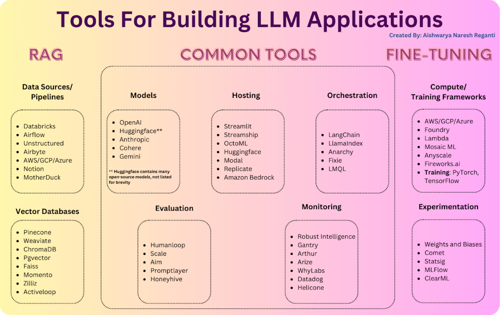

# **Day 5: Tools for Building LLM Applications**

## **Types of LLM Applications:**

1.  **Custom Model Adaptation**:

    -   This includes making new models from scratch or adjusting
        existing ones.

    -   Creating new models needs smart people who know a lot about
        machine learning and a lot of resources.

    -   Adjusting existing models, called fine-tuning, means updating
        them with new data. It\'s getting easier because of open-source
        tools, but it still needs a smart team and can sometimes cause
        unexpected problems. Even with challenges, both ways are getting
        used more and more in different industries.

2.  **RAG-based Applications**:

    -   Retrieval Augmented Generation (RAG) is one of the simplest and
        most popular methods right now.

    -   In RAG, we use a basic model and add extra information to help
        it understand better.

    -   This extra info comes from special databases called vector
        databases, where words or phrases are stored in a special way.

    -   By using this extra info, RAG helps the model understand natural
        language better and get insights faster, without needing lots of
        extra training.

    -   RAG is great because it can work around some of the usual model
        limits, and it\'s cheap and easy to use. It fits well into
        different apps and systems, making it useful for lots of people
        and companies. Plus, it helps keep data up-to-date and works
        smoothly with different applications.

## **Types of Tools**:

There are four main groups of tools:

1.  **Input Processing Tools**: These tools are for taking in data and
    different inputs for the application.

2.  **LLM Development Tools**: These tools help interact with the Large
    Language Model (LLM).

3.  **Output Tools**: These tools handle the output from the LLM
    application.

4.  **Application Tools**: These tools are in charge of managing all
    aspects of the first three groups.

When you use RAG in an application, it goes like this:

1.  **User Asks**: The user types a question or request into the app.

2.  **Finding Information**: The app searches for relevant info using a
    special method called embedding search. This method uses a special
    type of language model, data sources, and a database to organize the
    info.

3.  **AI Processing**: It sends the documents it finds and the user\'s
    question to the language model for processing.

4.  **Answering**: The AI thinks about it and gives an answer, which the
    app shows to the user.

All of this happens as part of how the app is built. It\'s designed to
run the language model and keep an eye on what it says. For tasks like
fine-tuning, most of the process stays the same. But sometimes, we might
need special tools and power just for fine-tuning the model. And
sometimes, we might not need to use outside data sources, so we can skip
that part.

## **Input Processing Tools**:

1.  **Data Pipelines/Sources**: In applications using Large Language
    Models (LLMs), managing and processing data effectively is crucial.
    These apps handle different types of data, like text documents,
    PDFs, and structured formats like CSV files or SQL tables. To handle
    this variety, we use various tools to load and transform data. These
    tools include:

    -   **Data Loading and ETL (Extract, Transform, Load) Tools**: These
        are like the backbone of managing data. Tools like Databricks
        and Apache Airflow are super popular for organizing and working
        with data. They help with things like machine learning,
        analytics, and keeping track of how data moves around.

    -   **Specialized Data-Replication Solutions**: While we already
        have ways to handle data in LLM apps, there\'s room to make them
        even better, especially by creating new tools just for LLM apps.
        These new tools could make it easier to put data into the apps
        and use it, making the apps work better and letting them do more
        stuff.

2.  **Vector Databases**: In the process of Retrieval Augmented
    Generation (RAG), where relevant documents are identified based on
    similarity, vector databases are essential. Their main job is to
    store, compare, and retrieve embeddings efficiently. Among various
    options, Pinecone is popular for its cloud-hosted nature and
    features like scalability and uptime guarantees.\
    here are various options like open-source systems (Weaviate, Vespa,
    Qdrant), local vector management libraries (Chroma, Faiss), and OLTP
    Extensions (pgvector). These cater to different needs, from tailored
    platforms to small-scale applications. As technology evolves,
    open-source providers are moving into cloud services, but achieving
    high performance in the cloud remains a challenge.

> .

## **LLM Development Tools:**

Development tools are essential for creating and optimizing language
models for specific tasks or domains. These tools streamline the
development process, making it easier for developers to build, test, and
deploy language models effectively. Here are four key categories of
development tools commonly used in LLM applications:

1.  **Models**: These are the core components of LLM applications,
    providing the language processing capabilities. Developers can
    choose from various models, including those offered by OpenAI API or
    open-source alternatives on platforms like Huggingface. The choice
    of model depends on factors such as versatility, accuracy, and the
    need for fine-tuning.

2.  **Orchestration**: Orchestration tools streamline complex processes
    involving interactions with LLMs. They automate tasks like prompt
    creation, data integration, and API management, making application
    development easier. Frameworks like LangChain and LlamaIndex
    simplify these processes and allow developers to avoid vendor
    lock-in by supporting multiple LLMs.

3.  **Compute/Training Frameworks**: These frameworks provide the
    necessary infrastructure for handling the computational demands of
    LLM applications. Cloud providers like AWS offer scalable resources,
    while specialized companies like Fireworks.ai optimize performance
    for LLMs. Deep learning frameworks like PyTorch and TensorFlow are
    commonly used for training LLMs due to their flexibility and
    scalability.

4.  **Experimentation Tools**: Experimentation tools are crucial for
    optimizing LLM applications. They help track experiments, manage
    hyperparameters, and evaluate model performance. Platforms like
    Weights & Biases and Hugging Face aid in experiment tracking, model
    development, and deployment. Tools like Statsig evaluate model
    performance in real-world environments, allowing developers to
    gather feedback and improve their models systematically.

## **Application Tools:**

Application tools in the context of large language model (LLM)
development are resources and software utilized for deploying, hosting,
and monitoring LLM applications. These tools are crucial for ensuring
the smooth functioning, performance optimization, and continuous
improvement of LLM-powered applications.

1.  **Hosting:** Hosting services provide the infrastructure needed to
    deploy and make large language model (LLM) applications accessible
    to users. They include traditional server setups as well as
    innovative solutions for edge computing and browser-based
    deployment. These services focus on privacy, security, low latency,
    and cost-effectiveness.

2.  **Monitoring:** Monitoring and observability tools are essential for
    maintaining and optimizing LLM applications post-deployment. They
    track key metrics such as model performance, latency, cost, and
    overall behavior. Insights from monitoring tools inform prompt
    iteration and model experimentation, ensuring efficient,
    cost-effective, and user-aligned performance.

## **Output Tools: Evaluation**

When people build apps with language models (LLMs), they need to make
sure the model works well, doesn\'t cost too much to use, and responds
quickly. But changing things like the questions we ask the model or
making the model smarter can affect these things. To figure out how well
the model is doing, we use evaluation tools.

### **Types of Evaluation Tools**:

1.  **Easy Prompt Testing Tools**: These tools are great for people who
    aren\'t coding experts. They let developers try different questions
    for the model and see how it responds without needing to write a lot
    of code. Examples include Humanloop and PromptLayer.

2.  **Keeping an Eye on Performance**: Once the app is up and running,
    it\'s important to check how well it\'s working in real life.
    Performance tools help us see if the model is still doing a good job
    and if there are any problems. They can also tell us if the model
    starts to work worse over time. Tools like Honeyhive and Scale AI
    help developers catch problems early so they can fix them fast and
    keep the app working well.

## **Top 10 LLM tools**

1.  **LLaMA 2**

> This tool from Meta is a big deal in the world of large language
> models. It has 7 to 70 billion settings and can learn from feedback
> from humans. It\'s great for making chatbots and helping with coding
> tasks. Meta wants everyone to be able to use AI, so they made LLaMA 2
> open for anyone to use and customize.

2.  **Anthropic**

> Anthropic\'s Claude is a really useful AI helper introduced in 2021.
> It\'s good at lots of things like summarizing, answering questions,
> and coding. They have different versions to suit different needs, with
> one called Claude Instant that\'s faster and cheaper. Anthropic aims
> for reliability and making sure Claude can do lots of different tasks
> well.

3.  **Bloom**

> Released in 2022, BLOOM is a big step in making AI available to
> everyone. It\'s got a special way of learning with 176 billion
> settings, and it\'s really good at writing in different languages.
> BLOOM is open-source, which means anyone can see how it works and use
> it. They believe in sharing and working together.

4.  **Cohere**

> Cohere makes it easy for developers to use AI for tasks like
> summarizing text or figuring out what text is about. Their model
> called Command is especially good at writing text. They provide
> ready-made models, so developers don\'t have to spend a lot of time
> training their own.

5.  **Crowdworks**

> Crowdworks helps businesses label their data using AI, which makes it
> more accurate. This labeled data helps make better AI models, even
> with less data to start with. This makes the whole process of teaching
> AI faster and better.

6.  **Bert**

> Bert is a language model made by Google that\'s really popular. It\'s
> good at lots of things like understanding feelings in text and
> analyzing medical notes. Lots of people use Bert because it\'s open
> for anyone to use and there are many versions for different needs.

7.  **Lightning AI**

> Lightning AI makes it easier for people to work with AI. Their tools
> help with every step of the process, from getting data to making AI
> models. They aim to make it simple for different parts of AI to work
> together smoothly.

8.  **Falcon 180B**

> Falcon 180B is a big AI model made by the United Arab Emirates. It\'s
> got a whopping 180 billion settings and does really well with language
> tasks. This model helps close the gap between fancy AI models and ones
> anyone can use.

9.  **OPT-175B**

> Meta\'s OPT series, especially OPT-175B, is super advanced for
> research. It\'s really good for different tasks, and it helps push AI
> forward.

10. **MindsDB**

> MindsDB helps connect AI models with data, making it easier for them
> to work together. They use a virtual database that lets people
> interact with AI using regular language, which makes using AI in
> businesses easier.
